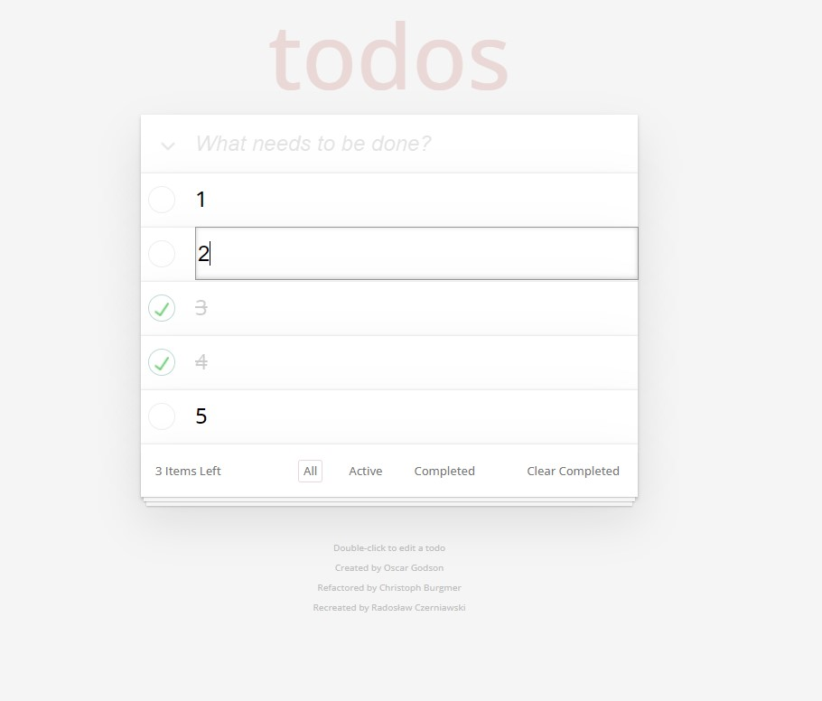

# todos Clone

This is a recreation of a JS app called [todos](https://todomvc.com/examples/vanillajs/), using `React.js` and SASS.

## Overview
My task was to recreate app called `todos` using `React.js` and to store it's data in 3 different ways:

- in Local Storage on branch `localStorage`,
- using json-server on branch `json-server`,
- and finally in MongoDB using my own backend written in node.js on branch `express-backend-mongo`.

The last case apart from storing data in MongoDB also enables registering multiple users, gives users ability to login / logout from the app and introduces user-assigned notes. Every user can create his own collection of notes.

Every app's version is stored on different branch and can be viewed separately.

## Tech

For every case I used basic `React.js`, CSS framework called `SASS` and a few libraries (like `uniqid` for generating unique ids).

In the last case for creating custom backend communicating with MongoDB and Frontend I used;
- `express` framework,
- `mongoose` for creating data schemas appropriate for MongoDB,
- `bcrypt` for hashing users passwords,
- `JSON Web Token` for creating web tokens for specific users,
- `Cookie Parser` for saving web tokens in cookies.
